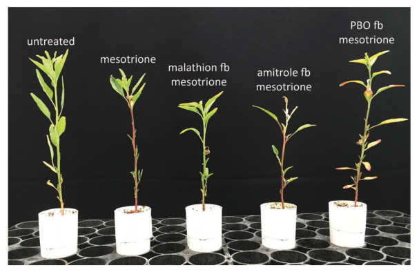

```{r include=FALSE}
library(tidyverse)
library(icons)
```

```{r setup, include=FALSE}
options(htmltools.dir.version = FALSE)
knitr::opts_chunk$set(
  fig.width=9, fig.height=3.5, fig.retina=3,
  out.width = "100%",
  cache = FALSE,
  echo = TRUE,
  message = FALSE, 
  warning = FALSE,
  hiline = TRUE
)
```

```{r xaringan-themer, include=FALSE, warning=FALSE}
library(xaringanthemer)
style_duo_accent(
  primary_color = "#800000",
  secondary_color = "#808080",
  inverse_header_color = "#FFFFFF"
)
```

```{r meta, echo=FALSE}
library(metathis)
meta() %>%
  meta_general(
    description = "Oliveira's interview at the University of Copenhagen",
    generator = "xaringan and remark.js"
  ) %>% 
  meta_name("github-repo" = "maxwel/copenhagen_talk") %>% 
  meta_social(
    title = "Weed ecologist with University of Copenhagen",
    url = "https://uc-oliveira.netlify.app/",
    image = "images/dandelion.jpeg",
    image_alt = "This an image of a dandelion. One of the most common weed species worldwide",
    og_type = "website",
    twitter_card_type = "summary_large_image",
    twitter_creator = "@maxwelco"
    ) %>% 
   include_meta()
```


```{r features, include=FALSE, warning=FALSE}
xaringanExtra::use_search(show_icon = TRUE,
                          position = "top-left")
xaringanExtra::use_webcam()
#xaringanExtra::use_freezeframe()
xaringanExtra::use_tile_view() # use letter O
xaringanExtra::use_share_again()
xaringanExtra::use_scribble() # use letter S
xaringanExtra::use_fit_screen()
xaringanExtra::use_broadcast() # use P
```


class: middle, center

## Maxwel Coura Oliveira


[`r icon_style(fontawesome("github"), style = "solid")` @maxwelco](https://github.com/maxwelco)  
[`r icon_style(fontawesome("twitter"), style = "solid")` @maxwelco](https://twitter.com/maxwelco)  
[`r icon_style(fontawesome("link"), style = "solid")` maxweeds.rbind.io](https://maxweeds.rbind.io)

---
background-image: url(https://source.unsplash.com/ZI33wmNexYI)
background-position: right
background-size: contain

## Education background

- Universidade Federal dos Vales do Jequitinhonha e Mucuri

    - BSc in Agronomy
    - MSc in Crop Science (Weed Science)

- University of Nebraska-Lincoln

    - PhD in Weed Science

.footnote[Image: Sophie Louisnard/Unsplash]

---
background-image: url(https://source.unsplash.com/CWbxnAk77so)
background-position: left
background-size: contain

.pull-right[
## Relevant professional experience

- The Ohio Program
    
    - Long's Family Farm (MI)
    - Intergrow greenhouses (NY)

- Timac Agro Brasil

- University of Wisconsin-Madison
  
    - Postdoc/Research Associate
    
- Universidade do Oeste Paulista
    
    - Assistant Professor
    
.footnote[Image: Museums Victoria/Unsplash]
]

---

## Herbicide resistance evolution

.pull-left[
### Confirmation

- A HPPD-resistant *Amaranthus tuberculatus* (waterhemp) biotype from [Nebraska](https://doi.org/10.1017/wet.2016.4)

<center>

</center>

]

.pull-right[
### Monitoring

- EPSPs and PPO resistance in [Palmer amaranth](https://doi.org/10.1017/wet.2020.74)

<center>

</center>
]

---

## Herbicide resistance evolution

.pull-left[
### Inheritance

Inheritance study in a HPPD-resistant waterhemp biotype from [Nebraska](https://doi.org/10.3389/fpls.2018.00060)

<center>

</center>
]


.pull-right[
### Gene flow 
HPPD-resistant waterhemp and Palmer amaranth resistance [transfer](https://doi.org/10.1111/tpj.14089)

<center>

</center>
]


---


## Herbicide resistance evolution

### Reversing resistance 


- HPPD-resistant waterhemp from [Nebraska](https://doi.org/10.1002/ps.4697)

- Use of cytochrome P450 inhibitors


.pull-left[

]

.pull-right[

]

---
background-image: url(images/spraying.png)
background-position: right
background-size: contain


## Weed Management

- Herbicides

- Cover crops

- Row width

- Tillage

- Flaming 📛


---

background-image: url(https://source.unsplash.com/5pKQLSanZDI)
background-position: left
background-size: contain


.pull-right[
## Surveys

Paper and online-based survey with stakeholders

- Adoption of dicamba in [Nebraska](https://doi.org/10.1017/wet.2018.62)

- Assessment of cover crops in [Nebraska](https://doi.org/10.3390/agriculture9060124)

- Survey of weed management in Wisconsin

- Crop and weed management in [Brazil](https://doi.org/10.1017/wet.2020.96)

- Weed management in horticultural crops in Brazil

.footnote[Image: Taylor Siebert/Unsplash]
]


---

## Crop-weed interactions

.pull-left[

- Crop-weed [competition](https://onlinelibrary.wiley.com/doi/abs/10.1111/wre.12317)

- [Light quality](https://maxweeds.rbind.io/pdf/2017-light-quality.pdf) on crop-weed interaction

- [Critical time](https://doi.org/10.1017/wet.2019.18) for weed control
]


.pull-right[

]

---

## Plant adaptation

Palmer amaranth adaptation to the US Midwest agroecosystem - not published yet

.pull-left[
<center>

</center>
]


.pull-right[
<center>

</center>
]


---
background-image: url(https://source.unsplash.com/1LLh8k2_YFk)
background-position: right
background-size: contain

## Data science

- **Languages**: [`r icon_style(fontawesome("r-project"), style = "solid")`](https://www.r-project.org/),
[<span class="latex">L<sup>a</sup>T<sub>e</sub>X</span>](https://www.latex-project.org/), [`r icon_style(fontawesome("css3"), style = "solid")`](https://www.w3.org/Style/CSS/Overview.en.html), [`r icon_style(fontawesome("html5"), style = "solid")`](https://www.w3schools.com/html/html_intro.asp), [`r icon_style(fontawesome("markdown"), style = "solid")`](https://www.markdownguide.org/)

- Github `r icon_style(fontawesome("github"), style = "solid")`

- Tidyverse [instructor](https://education.rstudio.com/trainers/people/oliveira+maxwel/)

- Data [visualization](https://github.com/maxwelco/Tidy-Tuesday) 📊

- Statistical modeling 📈

- Blog - [maxweeds](https://maxweeds.rbind.io/) and [Open Weed Science](https://www.openweedsci.org/)

- Manuscripts 📜

- Shiny [app](https://maxwelco1.shinyapps.io/fundamax/)

.footnote[Image: Markus Spiske/Unsplash]


---

name: goodbye
class: right, middle, blue


# Thank you!

#### You can find me at...

[`r icon_style(fontawesome("github"), style = "solid")` @maxwelco](https://github.com/maxwelco)  
[`r icon_style(fontawesome("twitter"), style = "solid")` @maxwelco](https://twitter.com/maxwelco)  
[`r icon_style(fontawesome("link"), style = "solid")` maxweeds.rbind.io](https://maxweeds.rbind.io)  
[`r icon_style(fontawesome("envelope-square"), style = "solid")` maxwelco@gmail.com](mailto:maxwelco@gmail.com)
